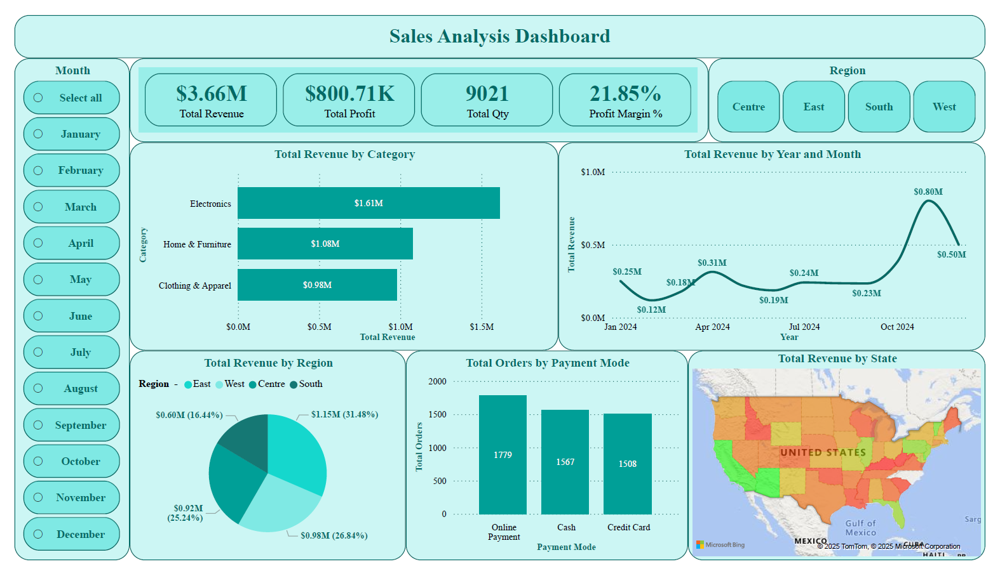

# 💡 Power Bi Project by Yash Yennewar

# 📊 Retail Sales Business Analysis
An Power BI project analyzing retail sales and customer behavior using interactive dashboards, DAX measures, and a star-schema data model to deliver actionable business insights.

## 🔗 Project Link :

[Retail_Sales_Business_Analysis](Retail_Sales.pbix)

---

## 📌 Project Overview :

This project is an **end-to-end Power BI Retail Analytics solution** built to analyze **Sales performance and Customer behavior** using a clean star-schema data model. It demonstrates practical BI skills such as **data modeling, DAX measures, interactive dashboards, and business storytelling**, making it ideal for portfolio and interview showcases.

The solution consists of **two interactive dashboards**:

* **Sales Analysis Dashboard** – focuses on revenue, profit, regions, categories, and trends
* **Customer Analysis Dashboard** – focuses on customers, segments, age groups, and purchasing behavior

---

## 🎯 Business Objectives :

* Track overall **Revenue, Profit, Quantity, and Profit Margin**
* Identify **top-performing categories, regions, states, and customers**
* Analyze **monthly sales trends**
* Understand **customer segments, age groups, and purchase frequency**
* Enable decision-makers to slice data by **Month and Region**

---

## 🗂️ Dataset Description :

The project uses a **relational dataset** with two core tables:

### 1️⃣ Customer Table (Dimension)

| Column           | Description                              |
| ---------------- | ---------------------------------------- |
| Customer_ID      | Unique customer identifier (Primary Key) |
| Customer_Name    | Customer full name                       |
| Age              | Customer age                             |
| Age Group        | Young Adult / Adult / Elder              |
| Customer Segment | Consumer / Corporate / Home Office       |
| Region           | East / West / Centre / South             |
| State            | Customer state                           |
| City             | Customer city                            |
| Country          | Country                                  |
| Email            | Customer email                           |

### 2️⃣ Sales Table (Fact)

| Column       | Description                          |
| ------------ | ------------------------------------ |
| Order_ID     | Unique order identifier              |
| Order Date   | Order transaction date               |
| Customer_ID  | Foreign key linked to Customer table |
| Category     | Product category                     |
| Sub_Category | Product sub-category                 |
| Product_Name | Product name                         |
| Quantity     | Units sold                           |
| Revenue      | Sales revenue                        |
| Profit       | Profit amount                        |
| Unit_Price   | Price per unit                       |
| Payment Mode | Cash / Credit Card / Online          |

---

## 🔗 Data Model :

* **One-to-Many Relationship**
* Customer[Customer_ID] → Sales[Customer_ID]
* Customer table acts as a **dimension table**
* Sales table acts as a **fact table**
* Model is optimized for **analytical queries and DAX performance**

This structure supports scalable reporting and follows **best practices of dimensional modeling**.

## 📸 Data Model Screenshot : 


---

## 📈 Dashboards Overview :

## 1️⃣ Sales Analysis Dashboard :

### 🔹 Key KPIs

* **Total Revenue:** $3.66M
* **Total Profit:** $800.71K
* **Total Quantity Sold:** 9,021
* **Profit Margin:** 21.85%

### 🔹 Visuals Included

* **Total Revenue by Category** (Bar Chart)
* **Total Revenue by Year & Month** (Line Chart)
* **Total Revenue by Region** (Pie Chart)
* **Total Orders by Payment Mode** (Column Chart)
* **Total Revenue by State** (Map Visual)

### 🔹 Filters / Slicers

* Month slicer (January–December)
* Region slicer (Centre, East, South, West)

### 🔹 Key Insights

* Electronics is the **highest revenue-generating category**
* Online Payment is the **most preferred payment mode**
* Certain months show clear **seasonal revenue spikes**
* East and West regions contribute significantly to total sales



---

## 2️⃣ Customer Analysis Dashboard :

### 🔹 Key KPIs

* **Total Customers:** 1,000
* **Total Orders:** 4,854
* **Average Order Value (AOV):** $755.01
* **Purchase Frequency:** 4.85

### 🔹 Visuals Included

* **Top Customers by Revenue** (Bar Chart)
* **Total Revenue by Customer Segment** (Bar Chart)
* **Total Revenue by Age Group** (Donut Chart)
* **Customer-Level Detail Table** with:

  * Revenue
  * Profit
  * Orders
  * Quantity

### 🔹 Key Insights

* Home Office segment generates the **highest revenue**
* Adult age group contributes the **largest revenue share**
* A small group of customers drives **high revenue concentration**


---

## 🧮 DAX (Data Analysis Expressions) Measures Used : 

* Total Revenue
* Total Profit
* Profit Margin %
* Total Quantity
* Total Orders
* Average Order Value (AOV)
* Purchase Frequency

Some important DAX measures created for the analysis :
```
DAX
Total Revenue = SUM(Sales[Revenue])
Total Orders = DISTINCTCOUNT(Sales[Order_ID])
Profit Margin % = DIVIDE([Total Profit],[Total Revenue],0)
Avg_Order_Value_AOV = DIVIDE([Total Revenue],[Total Orders],0)
```

---

## 🛠 Tools & Technologies :

* **Power BI Desktop**
* **DAX (Data Analysis Expressions)**
* **Data Modeling (Star Schema)**
* **Power Query (ETL)**
* **Microsoft Bing Maps (for Geo Analysis)**

---

## 📂 Project Files :

* `Retail_Sales.pbix` → Power BI project file
* `README.md` → Project documentation
* Dashboard screenshots

---

## 🚀 How to Use :

1. Download the `.pbix` file from this repository
2. Open it using **Power BI Desktop**
3. Explore dashboards using slicers and interactive visuals
4. Review data model and DAX measures for learning purposes

---

## 📌 Key Learnings & Skills Demonstrated :

* End-to-end BI project execution
* Clean data modeling with relationships
* Advanced KPI design
* Interactive dashboard storytelling
* Customer & sales performance analysis
